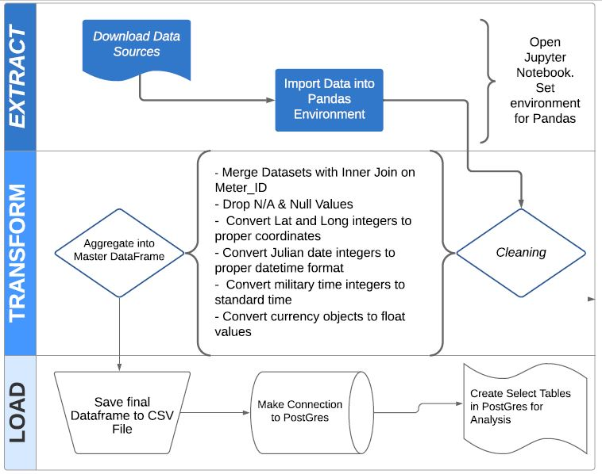

# ETL-Project

Steps to Follow:

Open Git bash, activate your python envrionment and open you jupyter notebook

Three files you would need - 
  - 1st File - CSV File from Google Dirve Link - https://drive.google.com/open?id=1nncijF9na3S-2AZlfNZCTvhvbPxcT8Te
  - 2nd File - Parking- Meters
  - 3rd File - Metadata

